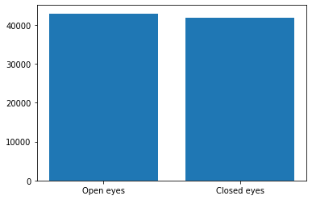
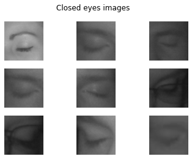
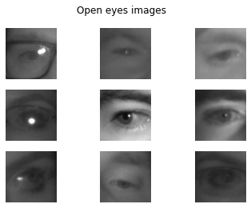
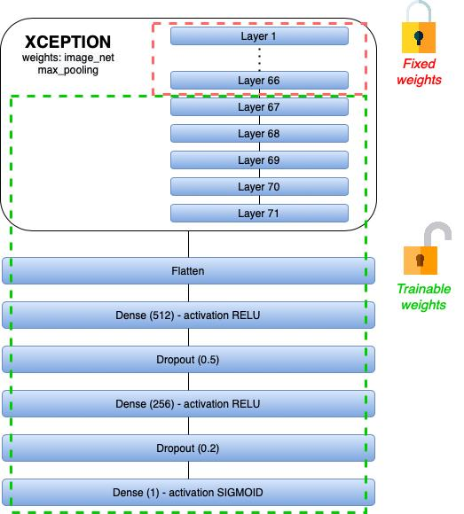

Davide Cremonini 14412 - Davide Sbetti 14032
------

# ATML Project: Driver Drowsiness Detection

## Problem Description

Each year about 328.000 drowsy driving crashes occur only in the U.S, according to the AAA Foundation for Traffic Safety report. 

In Italy, an estimate of 1/5 of driving crashes occurs for drowsy behaviours. 

These data show us how important it is to avoid such behaviours, in order to ensure safety on our streets. For this reasons, we decided to focus our efforts in this project on the detection of drowsy drivers. 

More specifically, our aim is to detect when people close extensively their eyes while driving.  

## The dataset

For the project, we decided to use the dataset that can be downloaded from http://mrl.cs.vsb.cz/eyedataset. 

The dataset contains infrared images in low and high resolution, all captured in various lightning conditions and by different devices, of people while driving. 

Overall, it contains 84.898 images of eyes, of which 41.945 are closed and 42.953 are open eyes images. 

Moreover, about 24.000 images are of people using glasses and, out of the total number of images, 53.630 were captured in bad light conditions, making the dataset quite diverse. 

Following, we report some examples of closed and opened eyes:

## Folder Preparation

During the first tests on the dataset, we noticed how it quite heavy to load directly in main memory (also on Google Colab) and we thought how the ImageGenerator class of Keras could help us to create a manageable flow of images.

This allows us to augment also the dataset, applying different techniques offered by the ImageGenerator class. 

However, in order to use the Keras' class, the input dataset should have a precise structure. 

Firstly, the dataset should be divided in subfolders, one for each class. This was the first step we undertook in the development of the project. We performed the images reorganisation on one of our laptops using the functions provided by the "os" python library. At the end, we ended up having two subfolders, one per class. 

Secondly, we soon discovered that we intended to have three different subsets of our starting dataset (train, validation and test sets). Unfortunately, the ImageGenerator class allows to split the data only in two subsets and, being a flow of images created "virtually", it was not possible to perform two different splits. 
For this reason, we decided to use the "splitfolders" library, which, given a directory structure with a subfolder for each class, is able to split the data in different sets. 

To keep some randomness, we decided to perform just one split with the library, obtaining training and validation sets, 70% and 30% respectively, while keeping the last split (validation and test sets) using Keras. 

## Data pre-processing and augmentation

After pre-processing the structure of our dataset using the split folder notebook, we moved to the data pre-processing part. 

The first data pre-processing step, once we read all images, was resizing the images to a common dimension (80x80). 

We prepare then a pre-processing function that we apply to each image, in order to convert it to a gray scale and to obtain still a three level image. This is necessary since the pre-trained network we would like to use expects an image with three channels.

This transformation was important, not for training reasons, since the images are already in a gray scale (with 3 channels), but to unify and apply the same pre-processing technique to the frames captured in real time by a camera, which are colored images with 3 channels, since the final goal is to apply the trained model in real-time using a camera. 

We then read the images composing our dataset using the ImageGenerator class, available in Keras, applying our pre-processing functions along with some data augmentation techniques (offered by the class). In particular we decided to tweak the following aspects: 

- horizontal flip
- brightness (range 0.2 - 0.8)
- zoom (range 0.3 - 0.7)
- rotation (range 20)

The values of the ranges were established after some experimental tests. 

At the same time, when loading the data, we perform the last split we decided not to perform externally in the split folder noteboo, to keep some randomness. We therefore split, always using the ImageGenerator class, the validation set in two equally sized parts, obtaining so the following sets: 

1. Training set: 70%
2. Validation set: 15%
3. Test set: 15%

## The model

For our classification task, we decided to use a pre-trained model, namely the Xception one (https://keras.io/api/applications/xception/), composed by 71 different layers. We chose it because it has been proved, also during our class experiments, to be quite robust.

We imported it using the pre-trained Imagenet weights and max pooling. Moreover, we set all layers of the pre-trained model to be untrainable, except the last five, to increase the model accuracy. 

After that, we defined our own model that we connected to the pre-trained one. 

We flattened so the output of the convolutional part defined in the pre-trained model and we applied a dense layer of 512 units, followed by another layer with 256 units, applying also a dropout of 0.5 and 0.3 respectively and relu as the activation function.

Our last layer is composed by a single unit with the sigmoid function as activation. 

Following, we report an illustration of our model and the pre-trained one: 

We then compiled the model using "nadam" as optimiser, the accuracy as metrics and the "binary crossentropy" as the loss function.

After compiling the model, we fed it with our training data, evaluating each epoch on the validation dataset. We then trained our network for 5 epochs.

At the end of training, we observed an accuracy of about 97% on both the training and validation datasets. 

After observing the good result in the training phase, we evaluated the model on our test set. The results of the evaluation confirmed an accuracy of more than 97%.  

At this point, we were ready to start the implementation of the Real-Time application of our model.

## Real-time application

## Challenges